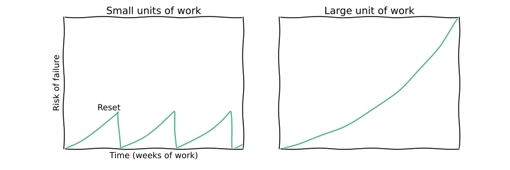
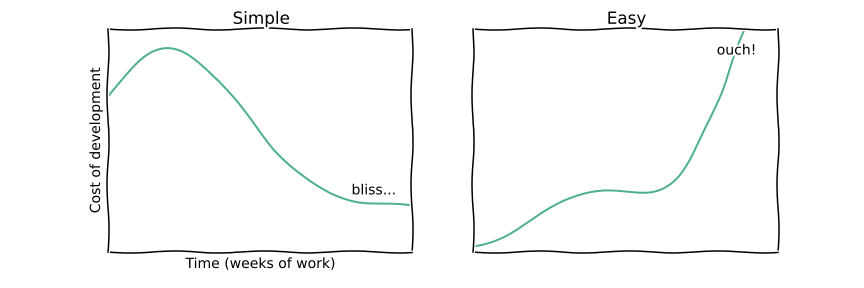
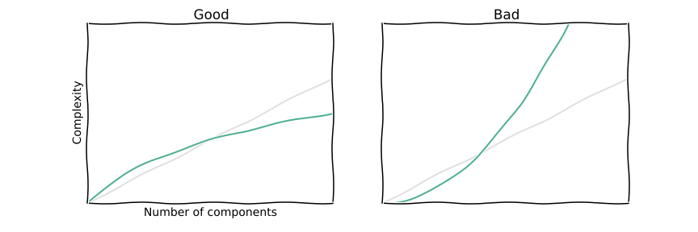

Title: Some a-priori good qualities of software development
Date: 2015-03-29
Short_summary: We look at some a-priori good ideas for software development, illustrated with graphs.
Category: Asides
Authors: Tom

We software developers live in a time with an
[inexhaustible supply](https://github.com/blog/1724-10-million-repositories)
of methodologies, libraries, tools and ideas. Evidence for or against
specific ideas is sparse: Gathering trustworthy, controlled data in
such complex environments is crazy expensive.

In order to navigate the landscape We Are Wizards picked a few
principles that we believe to be good *a priori*.

## Short iterations

We believe that short iterations are a great way of managing risk. The
left graphs is how we prefer to work, the right graph could e.g. be
the failed
[£12 billion NHS project](http://www.theguardian.com/society/2011/sep/22/nhs-it-project-abandoned).

Short iterations are harder to sell because each individual iteration
in itself is a bit disappointing and unambitious. However, we believe
that they significantly improve overall velocity.

## Simple but not easy

Simple is the opposite of *complex*. Complexity is bad: The
[butterfly flaps its wings](http://en.wikipedia.org/wiki/Butterfly_effect)
and triggers a catastrophe in a completely different component.

It is counter-intuitive but simplicity requires a lot of upfront work
and thought (see left graph).

In contrast *easy* means following the route of least resistance. At
the beginning projects move fast, but soon complexity catches up,
slowing down your development (right graph).

We believe in spending a little time at the beginning to keep things
simple.

## Complexity

Complexity must scale sub-linear with the number of moving parts in
the project:

We're consciously omitting the *how* in this post (e.g. layering,
stateless, ...) because it detracts from the main point: If complexity
scales super-linearly then your project can never grow beyond a
certain size.
