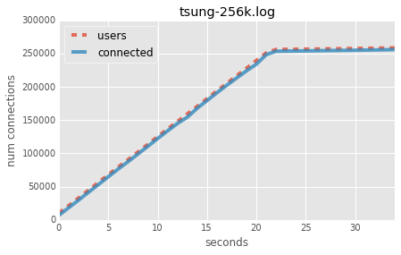
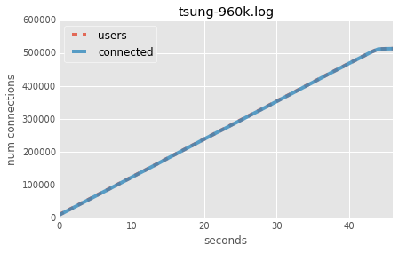

Title: A lot of websockets in Haskell
Date: 2015-11-05
Short_summary: I implement a very simple Haskell websocket chat server and benchmark it with tsung.
Category: Dev
Authors: Tom

*Reading time: ~20 minutes.*

I really enjoyed reading how the phoenix-framework people managed to
get to
[two million active websocket connections](http://www.phoenixframework.org/v1.0.0/blog/the-road-to-2-million-websocket-connections).

I've heard some very smart people say that Haskell has an amazing
runtime with very cheap threads. I have no reason to disbelieve them
but we thought it'd be fun to see how Haskell fares in a comparable
setup.

<!-- PELICAN_END_SUMMARY -->

## Test servers

Unlike the Phoenix people didn't have Rackspace sponsorship so we had
to resort to the common man's cheap machines: EC2 spot instances. We
bid $0.10 on two `m4.xlarge` machines with 16G of RAM and 4 cores
which usually cost around $0.05 per hour in eu-west.

We're using Nix to deploy tsung and a very simple Haskell chat program
that just broadcasts incoming messages to everyone.

> **tsung** is a tcp/web load generator written in Erlang configured
> through a XML domain-specific language
> ([website](tsung.erlang-projects.org)).

The core handler of our chat program looks like this (full source [here](https://github.com/WeAreWizards/haskell-websockets-tsung-benchmark/blob/master/code/src/Main.hs)):

```haskell
handleWS :: InChan ByteString -> PendingConnection -> IO ()
handleWS bcast pending = do
    localChan <- dupChan bcast
    connection <- acceptRequest pending

    -- Yes, we're leaking resources here :)
    forkIO $ forever $ do
        message <- readChan localChan
        sendTextData connection message

    -- loop forever
    let loop = do
            Text message <- receiveDataMessage connection
            writeChan bcast message
            loop
    loop
```

To run the ec2 machines we're using
[nixops](https://nixos.org/nixops/) which also does the spot-price
bidding for us:

```
nixops create '<nix/test-setup.nix>'
nixops deploy
```

(See
[here](https://github.com/WeAreWizards/haskell-websockets-tsung-benchmark/blob/master/nix/test-setup.nix)
for the full configuration including kernel tuning).

## tsung setup

Unfortunately I could not get the distributed tsung going: The
distributed testing uses an Erlang function called `slave:start` which
connects through SSH and spawns Erlang on the remote host. This failed
for reasons I didn't have time to debug.

But without the distributed testing there's a problem: A single server
can only open ~65000 connections because ports are limited to 16
bits. We want more connections though!

Luckily tsung supports using multiple virtual IP addresses for a
single network interface out of the box. We went to Amazon and clicked
"Assign new IP" a few times to assign more private IPs to our tsung
box.

Now we associate the new IPs with our network interface:

```shell
ip addr add 172.31.23.115/20 dev eth0
ip addr add 172.31.23.113/20 dev eth0
ip addr add 172.31.23.114/20 dev eth0
ip addr add 172.31.23.112/20 dev eth0
ip addr add 172.31.18.80/20 dev eth0
ip addr add 172.31.18.81/20 dev eth0
ip addr add 172.31.18.82/20 dev eth0
ip addr add 172.31.18.83/20 dev eth0
```

We have a
[slightly different](https://github.com/WeAreWizards/haskell-websockets-tsung-benchmark/blob/master/code/src/tsung-conf.xml)
tsung config from the Phoenix people which we copy to our tsung box:

```console
$ nixops scp --to tsung-1 code/src/tsung-conf.xml tsung-conf.xml
code/src/tsung-conf.xml -> root@52.31.104.126:tsung-conf.xml
tsung-conf.xml                                                  100% 1494     1.5KB/s   00:00
```

# Running tsung

Our Nix config tuned the TCP stack and increased kernel limits, but we
still need to run `ulimit` to make sure we're not hitting the default
limit of 1024 file descriptors:

```text
$ nixops ssh tsung-1
[root@tsung-1:~]# ulimit -n 2000000
[root@tsung-1:~]# tsung -f tsung-conf.xml start
Starting Tsung
Log directory is: /root/.tsung/log/20151104-1622
```

tsung exports some data via a web interface on port 8091. We use an
extra SSH tunnel so we can access this data on http://127.0.0.1:8091:

```console
$ ssh root@tsung-1 -L 8091:127.0.0.1:8091
```

## Problem 1: The firewall

All our Nix boxes are configured with a firewall enabled. This is
because I start from a template configuration instead of starting from
scratch.

The firewall uses connection tracking to make decisions, and
connection tracking requires memory. When that memory is full the
`dmesg` logs look like this:

```
[ 2960.570157] nf_conntrack: table full, dropping packet
[ 2960.575060] nf_conntrack: table full, dropping packet
[ 2960.629764] nf_conntrack: table full, dropping packet
[ 2960.678016] nf_conntrack: table full, dropping packet
[ 2992.936177] TCP: request_sock_TCP: Possible SYN flooding on port 8080. Sending cookies.  Check SNMP counters.
[ 2998.005969] net_ratelimit: 364 callbacks suppressed
```

That log also shows that we triggered the kernel's DOS protection
against SYN flooding. We fixed that by increasing
`net.ipv4.tcp_max_syn_backlog` and `net.core.somaxconn`.

Now when running tsung we got up to about 100k connections on the
Haskell websocket box:

```
[root@websock-server:~]# netstat -ntp  | grep -v TIME_WAIT | wc
 119748  838238 12094489
```

## Problem 2: The Erlang process limit

But then tsung's web UI would suddenly throw 500 errors and drop all
connections. Initially we could not figure out what was going on
because tsung is really slow at writing logs. Waiting for 5 minutes and
then checking the logs reveals the message:

```
=ERROR REPORT==== 4-Nov-2015::18:03:45 ===
Too many processes
```

We noticed that tsung supports changing the maximum number of internal
Erlang processes and we tried this:

```
tsung -p 1250000 -f tsung-conf.xml start
```

But no luck - the same problem occurs. Turns out that the `-p` switch
doesn't actually work (we filed
[a bug](https://github.com/processone/tsung/issues/136)).

We [patched](https://github.com/WeAreWizards/haskell-websockets-tsung-benchmark/blob/master/nix/maxproc.patch) tsung ourselves for now.


## Some performance numbers

So far we spent most of our time fighting tsung and the slighly
bizarre Erlang ecosystem. Here's what 100k users look like for CPU and
memory for the Haskell server:

```
  PID USER      PR  NI    VIRT    RES    SHR S  %CPU %MEM     TIME+ COMMAND
 1944 root      20   0 7210960 2.656g  22524 S 177.7 16.9   2:58.50 haskell-websock
```

2.6G, not bad! With all problems fixed we ran another test with 256k
users:

```
  PID USER      PR  NI    VIRT    RES    SHR S  %CPU %MEM     TIME+ COMMAND
 2252 root      20   0 11.237g 4.714g  22532 S 128.3 30.1   6:58.25 haskell-websock
```


## More addresses

In order to go higher we needed more IP addresses for tsung. This is
where we learnt that EC2 limits the number of additional private IPs
based on the instance type. You'll see a message like this:

> eni-5af8fa3d: Number of private addresses will exceed limit.

For m4.xlarge the limit is 15 addresses so we got another 6:

```
ip addr add 172.31.26.100/20  dev eth0
ip addr add 172.31.26.99/20  dev eth0
ip addr add 172.31.18.106/20  dev eth0
ip addr add 172.31.30.220/20  dev eth0
ip addr add 172.31.18.240/20  dev eth0
ip addr add 172.31.30.188/20  dev eth0
```

With 15 addresses in total we should get close to one million connections:

```python
>>> 15 * 64000
960000
```

But tsung needs more memory than our Haskell server and died at ~500k
connections:

```
/run/current-system/sw/bin/tsung: line 60: 29721 Killed                  [...]
```

The Haskell server was still running quite comfortably below 10G at
500k connections:

```
  PID USER      PR  NI    VIRT    RES    SHR S  %CPU %MEM     TIME+ COMMAND
 2320 root      20   0 16.879g 9.395g  22300 S   0.0 59.9  14:38.75 haskell-websock
```

That was certainly a fun afternoon! Time to clean up:

```console
$ nixops destroy
warning: are you sure you want to destroy EC2 machine ‘tsung-1’? (y/N) y
warning: are you sure you want to destroy EC2 machine ‘websock-server’? (y/N) y
```

The whole experiment took ~2.5 hours and cost us a grand total of
$0.25. To get to 4x the connections (two million) we'd need two
m4.4xlarge or r2.2xlarge instances but that's for another day.


## Graphs

Our graphs show very nicely that we add a bit more than 1000
connections a second, and that the connection count follows the user
count closely. I.e. there is no delay from the Haskell server.

Some unscientific testing also showed that propagating a message to
all 256k clients takes 10-50 milliseconds, so the 2 seconds quoted by
the Phoenix team for two million users sounds about right.

256k connections:



~500k connections (tsung died):


