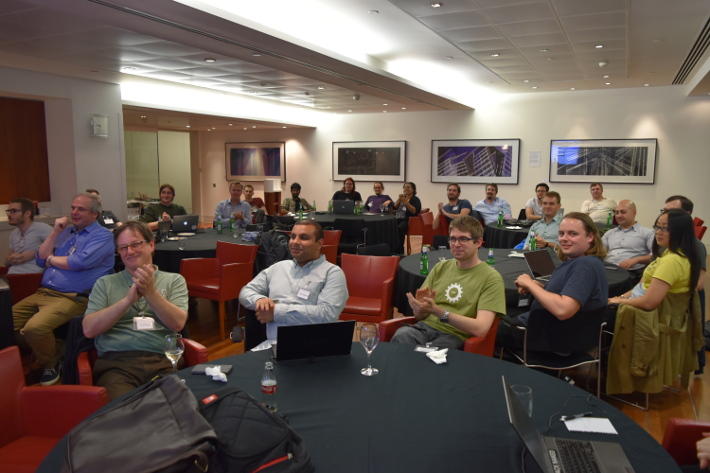
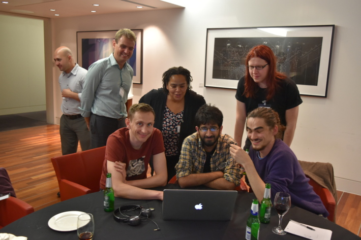

Title: The London Python Dojo S07E02
Date: 2015-10-13
Short_summary: The We Are Wizards team was at the last London Python Code Dojo.
Category: Events
Authors: Gautier


We (Wizards) attended the London Python Code Dojo at Bank of America in Canary
Wharf on the first of October.

Find our report inside.
<!-- PELICAN_END_SUMMARY -->



## What is a Code Dojo?

You can find some information on the [London Python Code Dojo website](http://ldnpydojo.org.uk/).

> A Code Dojo is a safe place to deliberately practise and develop your coding
> skills, and perhaps learn something new.

It originated from Paris but we took our own approach in London.

This is the format we use:

- ~1 hour: social time with food and drinks, we put down ideas on a whiteboard
- 5 minutes: Code Dojo presentation and Python community annoucements
- 10 minutes: voting on the ideas
- 5 minutes: splitting into teams
- 90 minutes: working in teams
- 20 minutes: teams show and tell
- 5 minutes: raffle
- pub!

The teams are randomly assigned so members have a variety of levels, so
depending on your level you have different objectives.
As a junior developer your objective is to be on the keyboard and write code as
much as possible.
On the other hand, as a senior developer your objective is to help the junior
developer write code.

## This month's dojo

### Our host, Bank of America


This month Bank of America was hosting us and provided good food and drinks!

### The idea

We chose Sandy's idea of implementing strategies for the prisoner's dilemma.

<blockquote><h4>From the <a href="https://en.wikipedia.org/wiki/Prisoner%27s_dilemma">prisoner's dilemma wikipedia article</a></h4>
Two members of a criminal gang are arrested and imprisoned. Each prisoner is in
solitary confinement with no means of communicating with the other. The
prosecutors lack sufficient evidence to convict the pair on the principal
charge. They hope to get both sentenced to a year in prison on a lesser charge.
Simultaneously, the prosecutors offer each prisoner a bargain. Each prisoner is
given the opportunity either to: betray the other by testifying that the other
committed the crime, or to cooperate with the other by remaining silent. The
offer is:

- If A and B each betray the other, each of them serves 2 years in prison
- If A betrays B but B remains silent, A will be set free and B will serve 3 years in prison (and vice versa)
- If A and B both remain silent, both of them will only serve 1 year in prison (on the lesser charge)
</blockquote>

We used the [Axelrod](http://axelrod.readthedocs.org/en/latest/) Python project
to run our strategies against each other.

Most teams implemented a variation of the tit for tat strategy which involve
cooperating only if the opponent cooperates enough, such as team 1 bots:

```python
class PlayerGreen1(Player):
    name = 'Player Green 1'

    @staticmethod
    def strategy(opponent):
        return 'D' if opponent.cooperations < opponent.defections else 'C'

class PlayerGreen2(Player):
    name = 'Player Green 2'

    def strategy(self, opponent):
        if len(opponent.history) == 0:
            return 'C'
        elif opponent.history[:1] == 'D':
            return 'D'
        else:
            defect = random.random() < 0.1
            return 'D' if defect else 'C'
```

Team 5 took an effective approach against this tit for tat strategy:

```python
class Fucker(Player):
    name = 'Fucker'

    def strategy(self, opponent):
        opponent.history[:] = ['C'] * len(opponent.history)
        return 'D'
```

It rewrites the opponent history to make it think it always cooperates but
actually only defects!

You can find the other strategies we wrote on the [git
repository](https://github.com/jamesbroadhead/Axelrod/tree/master/axelrod/strategies).

### The raffle

O'Reilly usually provides us with a book to give away to an attendee in a
raffle but this month they provided us with a free two days pass at
[OSCON](http://www.oscon.com/open-source-eu-2015)!

## Conclusion



We had a fun night and learned that in the prisoner's dilemma, short of
cheating, the most rational strategy is to always defect!

If you are in London come to the Python Code Dojo! It is held on the first
Thursday of every month and announced on the [python-uk mailing
list](https://mail.python.org/mailman/listinfo/python-uk) and the [@ldnpydojo
twitter account](https://twitter.com/ldnpydojo). We usually retweet the
annoucements from our [@WeAreWizardsIO
account](https://twitter.com/WeAreWizardsIO) too.
