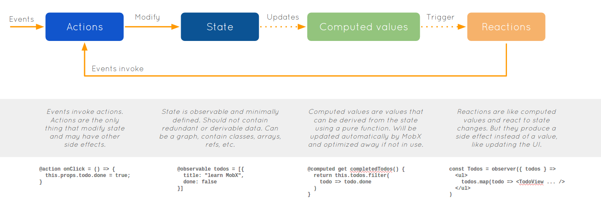

Title: A MobX introduction and case study
Date: 2016-10-26
Short_summary: Getting started with MobX and a real example
Category: Dev
Authors: Vincent

*Reading time: ~15 minutes.*

[MobX](https://mobxjs.github.io/mobx/) (previously mobservable) is a state management library for JavaScript frontend application. This article introduces it with examples as well as showing how it works in a real app with TypeScript. It is based on a talk I gave at the Osaka Web designers and developers meetup recently.
<!-- PELICAN_END_SUMMARY -->

## What is MobX and why should I look into it

### MobX?
Let's start by explaining what is MobX and how it works. It's presented as using Transparent Functional Reactive Programming.

Now, FRP is a very controversial term as everyone seems to have their own definition so let's forget about that and look at a illustration from the MobX docs (click on it to open in a new tab and get full size or open [this link](../images/mobx-flow.png)).


<a href="../images/mobx-flow.png" target="_blank"></a>

In short, actions modify the state, which triggers reactions. Part of the state can be derived automatically, such as the number of tasks left to do in a TODO list to take the example of the picture above.
What sets MobX apart from other Observable implementations is the transparent part. Reactions observe which observables you are using and subscribe to them automatically, without you having to explicitely subscribe to those.

Before we continue, a few more things:

- while some of the examples use React, MobX is not tied to any particular framework
- it is written in TypeScript so you get type definitions out of the box if you are using TypeScript
- the learning curve is very small and you will be able to start an app by the end of that article

### Why would I use it instead of Redux/ImmutableJS or library X?
This part is written from my experience using both Redux/ImmutableJS and MobX with React in [Proppy](https://proppy.io), our app to write proposals for freelancers and small agencies/companies. Its frontend is written in TypeScript, which was one of a big reason to moving to MobX as we will see in a bit.

Our issues with Redux/ImmutableJS were twofold.

The first issue was that it is very verbose. You need to write an action, the reducer function, a selector and then connect the actions and the data on the React components.

The second issue only occurs if you are using TypeScript like us. You also need to add the types of actions and data at each step and sometimes even repeat them if you are passing down actions to dumb components. We were also using ImmutableJS records with maps in them which meant the code was very often stringly typed. For example, getting a value using `.getIn(["blocks", id, "data", "value"])` was common and there was no typecheck whatsoever.

With MobX we only have to mention the types and, as we will see when showing examples of Proppy, get full typechecking as we are only dealing with plain JavaScript objects.

Note that using MobX means you have to give up immutability, which could be a showstopper for you.

## MobX by example

This section is a brief introduction to MobX. If you have already used it, you can safely skip to the next section to see some patterns/snippets from a live application.

Note that I will use ES6 syntax and decorators throughout the examples but it works in plain ES5 as well.

### Observing arrays and map changes with autorun
Let's start with observing arrays and maps, as it constitutes a big chunk of what we would want
to observe.

```js
import { observable, asMap, autorun } from "mobx";

// becomes an ObservableArray (same API as normal array)
const numbers = observable([1,2,3]);
// becomes an ObservableMap (same API as Map)
const users = observable(asMap({"bob": "bob"}));
```

To show the changes to observable values, we will use the `autorun` function provided by the mobx package. This function takes a function as argument and call it once to detect which observables are being used in it and subscribe to them.

```js
autorun(() => {
  console.log("autorun!", numbers.toJS(), users.toJS());
});
// initial run: prints autorun! [1,2,3] {"bob": "bob"}
numbers.push(4);
// prints autorun! [1,2,3,4] {"bob": "bob"}
users.set("jane", "jane");
// prints autorun! [1,2,3,4] {"bob": "bob", "jane": "jane"}
```
We will show in the next section that `autorun` doesn't actually run everytime any observable is modified like the example above might indicate but only when one of those used in the function are modified.

### Observing class properties and transactions
The other thing that we typically want to observe are class properties.

```js
import { observable, autorun } from "mobx";

class Meetup {
  @observable name;
  @observable numberPeople;

  constructor(name, numberPeople) {
    this.name = name;
    this.numberPeople = numberPeople;
  }
}


const thisMeetup = new Meetup("Osaka Web designers and developers", 0);
autorun(() => {
  console.log(thisMeetup.numberPeople + " people");
});
thisMeetup.numberPeople = 1;
// prints "1 people"
```
In that example, both `name` and `numberPeople` are observable properties of the `thisMeetup` object but only `numberPeople` is used in the `autorun` function. Therefore, the following snippet will not print anything:

```js
thisMeetup.name = "Hello";
// doesn't print anything
```
Remember the T part of TFRP? MobX automatically figured out which observable to subscribe to and has done so transparently.

Reactions are synchronous so you might wonder how to avoid "useless" reactions, e.g. when setting multiple observables at once such as when receiving a response from a AJAX request. `transaction` solves that issue by not triggering reactions until the end of the function.

```js
transaction(() => {
  thisMeetup.numberPeople = 2;
  thisMeetup.numberPeople = 3;
  thisMeetup.numberPeople = 4;
});
// print "4 people"
```
In the example above, `autorun` only runs once: with `numberPeople` equal to 4, not with the intermediate 2 and 3.

### Computed values
In some cases, data can be derived directly from the state. To take a simplified example from Proppy, we are going to look at a row in a cost table: we have quantity and unit price and can therefore automatically calculate the total.
`computed` is lazy (won't be evaluated unless needed in a reaction) and it is memoized (if the observables used inside didn't change, it doesn't need to re-run and can return the current value).

```js
class TableRow {
  @observable quantity = 0;
  @observable price = 0;

  constructor(price) {
    this.price = price
  }

  // a getter
  @computed get total() {
    return this.price * this.quantity;
  }
}

const row = new TableRow(10);
console.log(row.total);
// prints 0 (since 10x0=0)
row.quantity = 10;
// Only computed on the call
console.log(row.total);
// prints 100
// Not recomputed if the observables used didn't change
console.log(row.total)
// prints 100
```

Note that `@computed` can only be used on [getter](https://developer.mozilla.org/en/docs/Web/JavaScript/Reference/Functions/get) in a class.

### Actions
Actions are functions that modify the state.
While, as shown in the previous examples, we can simply modify the object directly, it is not the recommended way to do so.

The recommended way is to wrap any actions that modify the state with the `action` function or decorator. This will accomplish a few things:

- wrap the function in a transaction automatically
- provide debugging info for that state change that can be displayed in dev tools

You can force your app to only modify state through actions by using `useStrict(true)` in your app.

```js
useStrict(true);

class TableRow {
  @observable quantity = 0;
  price = 0;

  constructor(price) {
    this.price = price
  }

  // a getter
  @computed get total() {
    return this.price * this.quantity;
  }

  @action setQuantity(quantity) {
    this.quantity = quantity;
  }
}

const row = new TableRow(10);
console.log(row.total);
row.setQuantity(10);
// Only computed on the call
console.log(row.total);
// Not recomputed if the observables used didn't change
console.log(row.total);

// Use `useStrict` to force state to only be modified in `action` fns
row.quantity = 10; // will error
```
We don't use the strict mode ourselves

## MobX in real life
Now that you know the basics of MobX, it's time to see how it looks in production.
It's currently the backbone of our frontend app in [Proppy](https://proppy.io) so we will use examples from it.

If you are doing SSR, be aware that the way we handle stores shown below will not work for you.

Converting Proppy to use MobX took about 4 days, numerous long-standing issues were fixed along the way and the end result was a deletion of around 1000 to 2000 lines (estimate as we also moved to use npm @types for typings in that branch).

### Stores
Our stores are simple singleton classes that have observable properties.
Here's a shorter version of one of our stores, dealing with clients for proposals.

```js
import { observable, action, map, transaction, ObservableMap } from "mobx";

// a class definition with types
import { Client } from "./models/Client";
import fetchling from "../utils/fetchling";
import uiStore from "./UIStore";

export class ClientStore {
  @observable clients: ObservableMap<Client> = map<Client>();

  getClient(id: number) {
    return this.clients.get(id.toString());
  }

  @action fetchAll(): Promise<any> {
    return fetchling("/clients").get().then((response: any) => {
      transaction(() => {
        this.setClients(response.clients);
      });
    });
  }

  @action deleteClient(clientId: number) {
    const client = this.clients.get(clientId.toString());
    return fetchling(`/clients/${clientId}`).delete()
      .then(() => {
        this.clients.delete(clientId.toString());
        uiStore.notify(`Client deleted`, false);
      })
      .catch(() => uiStore.notify(`Client ${client.name} could not be deleted. Please try again later`, false));
  }

  @action updateClient(clientId: number, name: string) {
    return fetchling(`/clients/${clientId}`).put({name})
      .then((response: any) => {
        this.clients.set(clientId.toString(), new Client(response.client));
        uiStore.notify(`Client updated`, false);
      })
      .catch(response => {
        uiStore.notify(`Client could not be updated. Please try again later`, true);
        if (response.errors) {
          return response.errors.errors;
        }
      });
  }
}

const clientStore = new ClientStore();
export default clientStore;
```
Quite simple stuff.
You can see we are calling another store from our store. That would be a big no-no in Redux and we were using a middleware to solve that previously.
It feels much nicer now: we have a full view of what's happening and it's very easy to see if something is missing (which was actually the case for some ajax requests).

This example doesn't really show it but every data stored in a store is typed and trying to access `client.random` would be a compiler error.
It really shines for complex objects like cost tables that were previously a simple map with no schema and are now fully typed objects with functions of their own. Thanks to that, we moved things such as calculating totals to the cost table class rather than a React component like before.

### Components
We're using the `mobx-react` package that gives us the `observer` decorator that we put on top of a component.
Doing so gives us the same thing as the `autorun` in the MobX by example section: when an observable used in the `render` function changes, the component will be re-rendered.
`@observer` also comes with an optimized `shouldComponentUpdate` that works very well in our experience: the only `shouldComponentUpdate` left in our code are the ones impossible to not handle manually due to `contenteditable`.

Since we don't do server side rendering, we can directly import a store and call its function directly. Here's a slightly modified code sample for the Settings>Clients page:

```js
import * as React  from "react";
import { observer } from "mobx-react";
import { observable } from "mobx";

import companyStore from "../../stores/CompanyStore";
import clientStore from "../../stores/ClientStore";
// ... some component import

@observer
export class Clients extends React.Component<{}, {}> {
  // not used, only here for the sake of example
  @observable clientAdded: boolean = false;

  // Our async loaded component will call that function and wait until
  // the promises complete to render that component
  static fetchData() {
    return Promise.all([
      companyStore.fetchUs(),
      clientStore.fetchAll(),
    ]);
  }

  renderClients() {
    return clientStore.clients.values().map(client => {
      return (
        <div className="client" key={client.id}>
          <span onClick={() => clientStore.deleteClient(client.id)} className="icon-delete" />
          <InlineInput
            value={client.name}
            onEnter={(value) => clientStore.updateClient(client.id, value)} />
        </div>
      );
    });
  }

  renderForm() {
    return (
      <InAppForm
        inline={true}
        resetOnSuccess
        submitText="Add client"
        onSubmit={(data) => clientStore.createClient(data)} />
    );
  }
  render() {
    return (
      <SettingsContainer>
        <div className="clients">
          <h2>Manage {your} clients</h2>
          {this.renderForm()}
          <div className="clients-list">
            {this.renderClients()}
          </div>
        </div>
      </SettingsContainer>
    );
  }
}
```
No ceremony needed, everything works out of the box as if I was just dealing with plain JavaScript objects. All the store functions and data are typed too. Trying to call `clientStore.deleteClient("1")` for example would be a compilation error and I only had to write the type once: in the store as shown before.

Another aspect not mentioned before is that you can also use `observable` to remove the need for React state.

Rather than having a state and updating it with `this.setState`, you can just update your variable directly and it will re-render the component if that property is used in the render method.
To use the previous example, if I wanted to display a banner after adding a client in that component I could set `this.client = true` and render something different when `this.client` is true. No more `this.setState({..} as any)` to satisfy the TypeScript compiler.
Another neat thing about using MobX for state is that changes will be logged if you are using dev tools.

### Dev tools
For React, `mobx-react-devtools` is available and is pretty great. See the gif below from its repo to have an overview of the 3 features.


I have mostly used the logging to inspect action and state changes while debugging and to spot erroneous updates and the re-rendering highlighter to figure out if some of our components were re-rendering too often.

## Useful links

- [Official docs](https://mobxjs.github.io/mobx/) and in particular [Common pitfalls & best practices](https://mobxjs.github.io/mobx/best/pitfalls.html) and [What does MobX reacts to?](https://mobxjs.github.io/mobx/best/react.html)
- [In-depth explanation of MobX](https://medium.com/@mweststrate/becoming-fully-reactive-an-in-depth-explanation-of-mobservable-55995262a254#.9aufnt6up)
- [Understanding MobX and when to use it](https://github.com/mobxjs/mobx/issues/199)
- [Example: real-life with router/ajax etc](https://github.com/mobxjs/mobx/issues/104)

## Conclusion

Overall, we are very happy with the transition to MobX and would recommend investigating it if you are looking for a state management solution, especially if you are using TypeScript or Flow.
I'm pretty impressed by the constant work the TypeScript team has accomplished and highly recommend it as well if you are planning to stay on the JavaScript side and not go for Elm/PureScript/etc.
